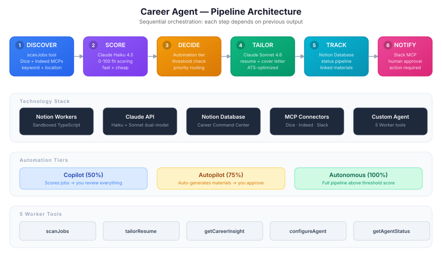
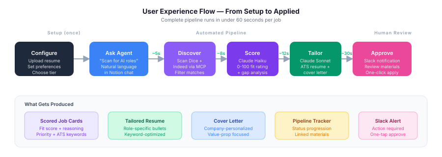
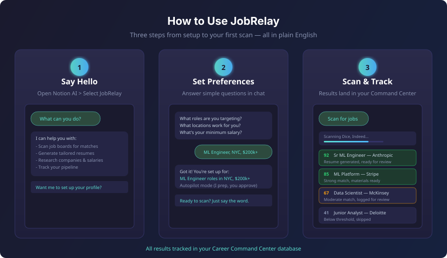
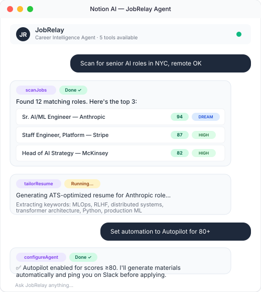
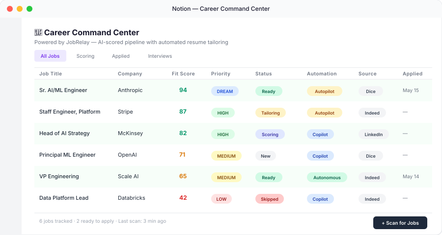

<p align="center">
  
</p>

<h1 align="center">JobRelay</h1>

<p align="center">
  <strong>AI-powered job application agent for Notion</strong><br/>
  <sub>Scans job boards, scores roles with Claude, generates tailored resumes, tracks your pipeline — all inside Notion.</sub>
</p>

<p align="center">
  
  
  
  
  
</p>

---

> **🏆 Built for the [Notion Developer Platform Hackathon](https://lu.ma/fyuf7) (May 16–17, 2026) — Theme 2: Workflow Relay**

<!-- 🎥 **[Watch the 60-Second Demo →](#)** -->

---

## Table of Contents

- [The Problem](#the-problem)
- [What JobRelay Does](#what-jobrelay-does)
- [How to Use JobRelay](#how-to-use-jobrelay)
- [Architecture](#architecture)
- [Career Command Center](#career-command-center)
- [Why This Architecture](#why-this-architecture)
- [Quick Start](#quick-start)
- [Project Structure](#project-structure)
- [Market Opportunity for Notion](#market-opportunity-for-notion)

---

## The Problem

The job search is broken — and existing tools make it worse.

| Metric | Data Point | Source |
|--------|-----------|--------|
| Applications to get one interview | **42 on average** | ResuTrack 2026 |
| Generic application → interview rate | **2–3%** | Resume Genius 2026 |
| Tailored application → interview rate | **7–9%** (2.1× higher) | TopCV 2026 |
| Applications per job posting | **250 avg** (400+ for entry-level) | HiringThing 2026 |
| Time spent customizing each application | **< 30 minutes** | Huntr 2026 |

**The market is polarized between two broken approaches:**

| Tool Type | Example | Problem |
|-----------|---------|---------|
| Spam cannons | LazyApply (2.4★ Trustpilot, 56% one-star) | Triggers spam filters, gets accounts banned, 34% accuracy on complex ATS |
| Passive trackers | Teal, Huntr | Organize your pipeline but don't do the work — you still write every resume |
| **Missing middle** | **JobRelay** | Scores, generates, tracks — with human approval before submit |

> **The gap:** No tool today combines intelligent scoring + tailored generation + Notion-native tracking in a single agent workflow. JobRelay fills that gap.

## What JobRelay Does

JobRelay is a **Notion-native career agent** that automates the entire job application pipeline using Notion Workers and Claude AI:

<p align="center">
  
</p>

**Six-step sequential pipeline** — each step depends on the output of the previous one:

| Step | What Happens | Tool / Model |
|------|-------------|--------------|
| 1. Discover | Scan Dice + Indeed for matching roles | `scanJobs` + MCP connectors |
| 2. Score | Rate each role 0-100 against your profile | Claude Haiku 4.5 (fast) |
| 3. Decide | Route based on automation tier + threshold | `configureAgent` settings |
| 4. Tailor | Generate ATS-optimized resume + cover letter | Claude Sonnet 4.5 (quality) |
| 5. Track | Update Career Command Center database | Notion Database API |
| 6. Notify | Ping Slack for human approval | Slack MCP |

## How to Use JobRelay

JobRelay is designed to feel like chatting with a helpful colleague — no code, no jargon, no setup wizards. Just open Notion AI and start talking.

<p align="center">
  
</p>

### Step 1: Say Hello

Open Notion AI chat, select **JobRelay**, and ask what it can do. The agent introduces itself in plain English and offers to set up your profile.

### Step 2: Set Your Preferences

The agent asks simple questions — no forms, no settings pages:
- *"What roles are you targeting?"*
- *"What locations work for you?"*
- *"What's your minimum salary?"*
- *"How hands-on do you want to be?"* (Copilot / Autopilot / Autonomous)

### Step 3: Scan and Track

Say **"scan for jobs"** and watch results flow into your Career Command Center. Each role gets a match score (0-100), fit explanation, and — for strong matches — a tailored resume generated automatically.

> **Design principle:** Following [Notion's best practices for Custom Agents](https://www.notion.com/help/best-practices-for-creating-and-optimizing-a-custom-agent) — start simple, build gradually, keep instructions clear, and never overwhelm the user with complexity.

---

## Architecture

<p align="center">
  
</p>

### Agent in Action

<p align="center">
  
</p>

### Dual-Model AI Strategy

| Model | Role | Why |
|-------|------|-----|
| **Claude Haiku 4.5** | Scoring (Step 2) | Fast, cheap — scores dozens of jobs in seconds |
| **Claude Sonnet 4.5** | Generation (Step 4) | Quality resume + cover letter writing |

### Three Automation Tiers

Users control how much the agent does autonomously:

| Tier | Automation | Behavior |
|------|-----------|----------|
| **Copilot** | 50% | Agent scores — you review everything |
| **Autopilot** | 75% | Agent generates materials — you approve before submit |
| **Autonomous** | 100% | Full pipeline for roles above your threshold score |

### Five Worker Tools

| Tool | Purpose |
|------|---------|
| `scanJobs` | Discover and parse job listings from connected boards |
| `tailorResume` | Generate ATS-optimized resume + cover letter for a specific role |
| `getCareerInsight` | Strategic career Q&A — salary data, interview prep, company research |
| `configureAgent` | Set automation tier, scoring thresholds, job sources, cadence |
| `getAgentStatus` | Report current configuration and last-run state |

## Career Command Center

The Notion database that tracks your entire pipeline. Below is a live example showing the agent scoring roles for a senior AI/ML professional targeting Anthropic, Stripe, McKinsey, OpenAI, and Scale AI — with fit scores ranging from 94 (DREAM match) to 42 (auto-skipped):

<p align="center">
  
</p>

| Property | Type | Purpose |
|----------|------|---------|
| Job Title | Title | Role name |
| Company | Text | Employer |
| Fit Score | Number | AI-scored match (0-100) |
| Priority | Select | DREAM / HIGH / MEDIUM / LOW |
| Status | Select | New → Scoring → Tailoring → Ready → Applied → Interview → Offer |
| Fit Reason | Rich Text | Why this role matches (or doesn't) |
| ATS Keywords | Rich Text | Extracted keywords for resume optimization |
| Source | Select | Dice / Indeed / LinkedIn / Manual |
| Automation Tier | Select | Copilot / Autopilot / Autonomous |
| Resume Link | Relation | Linked tailored resume page |
| Cover Letter Link | Relation | Linked cover letter page |
| Applied Date | Date | When application was submitted |

## Source Tier System

A prioritization framework that weights applications by discovery channel:

| Tier | Source | Typical Interview Rate |
|------|--------|----------------------|
| 1 | Direct referral from network | ~50% |
| 2 | Target company (you sought them) | ~25% |
| 3 | Recruiter outreach | ~15% |
| 4 | Job board (LinkedIn, Indeed) | ~5% |
| 5 | Cold apply | ~2% |

## Why This Architecture

Design decisions and tradeoffs that shaped JobRelay:

| Decision | Rationale |
|----------|-----------|
| **Sequential pipeline** (not parallel) | Each step's output feeds the next — you can't tailor a resume without scoring first |
| **Dual-model strategy** | Haiku is 10x cheaper for scoring bulk jobs; Sonnet produces higher-quality generation |
| **Notion-native** | Zero external infrastructure — no databases, no servers, no Docker. Everything lives in your Notion workspace |
| **Human-in-the-loop** | The agent never submits without approval. Trust is earned one application at a time |
| **Source tier weighting** | A referral (50% interview rate) shouldn't be scored the same as a cold apply (2%) |
| **Configurable autonomy** | Not everyone wants full autopilot. Copilot mode lets cautious users stay in control |

## Quick Start

### Prerequisites

- Node.js 18+
- [Notion CLI](https://ntn.dev) (`ntn`)
- [Anthropic API key](https://console.anthropic.com)
- Notion workspace with Custom Agents enabled

### Install & Deploy

```bash
# Install Notion CLI
curl -fsSL https://ntn.dev | bash

# Clone and setup
git clone https://github.com/nycsav/notion-career-agent.git
cd notion-career-agent
npm install

# Set your Anthropic API key
ntn workers env set ANTHROPIC_API_KEY

# Deploy to Notion
ntn workers deploy
```

Then open Notion AI chat and ask **JobRelay** to scan for jobs.

## Project Structure

```
notion-career-agent/
├── src/
│   └── index.ts          # Worker with 5 tools (~590 lines)
├── docs/
│   ├── architecture.svg  # Pipeline architecture diagram
│   ├── demo-flow.svg     # End-to-end user flow
│   ├── command-center.svg # Career Command Center mockup
│   └── agent-chat.svg    # Agent chat interaction
├── AGENT_PROMPT.md        # Custom Agent orchestration prompt
├── package.json
├── tsconfig.json
└── LICENSE                # MIT
```

## Technical Highlights

- **Sequential orchestration** — not parallel; each step's output feeds the next
- **Dual-model strategy** — Haiku for speed scoring, Sonnet for quality generation
- **Notion-native** — zero external infrastructure; everything lives in your workspace
- **Human-in-the-loop** — approval step before any application goes out
- **Production-grade scoring** — source tiers, match explanations, gap analysis, ATS keyword extraction
- **Configurable cadence** — on-demand, daily, weekly, or realtime scanning

## Market Opportunity for Notion

| Metric | Value |
|--------|-------|
| Notion total users | **100M+** (2026) |
| Primary demographic | 17–35 year olds — peak career transition years |
| Active job seekers in US alone (BLS) | **6.5M** monthly |
| Estimated Notion users actively job searching | **5–8M** (5–8% of base) |
| Career management TAM | **$15B** globally (LinkedIn, Indeed, Teal, Huntr) |

**Why this matters for Notion:**

- **Retention hook** — Job seekers check their pipeline *daily*. A Career Command Center makes Notion the first tab opened every morning, driving DAU during a user's highest-engagement life phase.
- **Workspace expansion** — Each job application generates 3–5 new Notion pages (resume, cover letter, company research, interview prep, offer comparison). A 20-application pipeline creates 60–100 pages of content.
- **Workers monetization** — JobRelay demonstrates the Workers compute model: AI-heavy workloads (scoring + generation) that justify per-run credit pricing. A power user running daily scans = steady compute revenue.
- **Platform stickiness** — Once your career history, tailored materials, and interview notes live in Notion, switching costs are high. This is the "second brain" use case applied to the highest-stakes personal workflow.
- **Network effects** — Users share Career Command Center templates, creating organic growth in Notion's template marketplace.

---

<p align="center">
  Built by <a href="https://ensolabs.ai">Enso Labs</a> · Powered by <a href="https://anthropic.com">Claude</a> · Deployed on <a href="https://developers.notion.com">Notion Developer Platform</a>
</p>
