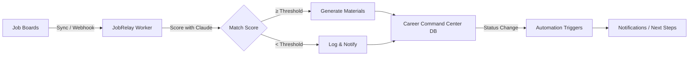

<p align="center">
  
</p>

<h1 align="center">JobRelay</h1>

<p align="center">
  <strong>AI-powered career agent for Notion Workers</strong><br/>
  <sub>Scans job boards, scores roles with Claude, generates tailored resumes, and tracks your application pipeline — all inside Notion.</sub>
</p>

<p align="center">
  <a href="https://www.notion.com/product/dev"></a>
  <a href="https://docs.anthropic.com"></a>
  
  
</p>

---

> **Built for the [Notion Developer Platform Hackathon](https://lu.ma/fyuf7) (May 16–17, 2026) — Theme 2: Workflow Relay**

---

## What It Does

JobRelay is a **Notion-native career agent** deployed as a Notion Worker. It uses the full Notion Workers SDK — managed databases, scheduled syncs, webhooks, automations, and AI tools — to automate the entire job application pipeline.



### Capabilities

| SDK Feature | Implementation |
|-------------|---------------|
| **Managed Database** | Career Command Center — auto-created with full schema on deploy |
| **Sync** | Daily job board scanner (Dice, Indeed) with incremental state |
| **Webhook** | Inbound job alerts from Zapier, email parsers, or direct POST |
| **Automation** | Status change handler — triggers on pipeline transitions |
| **Tools (×5)** | scanJobs, tailorResume, getCareerInsight, configureAgent, getAgentStatus |
| **Pacer** | Rate-limits Claude API calls (20 req/min) |
| **OAuth** | Ready for job board OAuth flows (extensible) |

### Pipeline Steps

| Step | Action | Model |
|------|--------|-------|
| 1. Discover | Sync from boards or receive webhook | — |
| 2. Score | Rate match 0–100 against profile | Claude Haiku 4.5 |
| 3. Decide | Route by automation mode + threshold | Rule engine |
| 4. Tailor | Generate resume + cover letter | Claude Sonnet 4.5 |
| 5. Track | Write to Career Command Center | Notion Managed DB |
| 6. Notify | Alert via Slack/Notion | Webhook/Automation |

---

## Quick Start

### Prerequisites

- [Notion CLI (`ntn`)](https://developers.notion.com/cli/get-started/overview) installed
- A Notion workspace on Business or Enterprise plan (for Workers)
- An [Anthropic API key](https://console.anthropic.com/)

### Setup

```bash
# 1. Clone the repo
git clone https://github.com/nycsav/notion-career-agent.git
cd notion-career-agent

# 2. Install dependencies
npm install

# 3. Authenticate with Notion
ntn login

# 4. Set your secrets
ntn workers env set ANTHROPIC_API_KEY=sk-ant-api03-...
ntn workers env set USER_PROFILE="Your career summary here..."

# 5. Deploy
ntn workers deploy

# 6. Add tools to your Notion Custom Agent
# In Notion → AI → Custom Agent → Add tool calls → Select JobRelay tools
```

### Local Development

```bash
# Type-check
npm run check

# Pull secrets for local testing
ntn workers env pull

# Test a tool locally
ntn workers exec scanJobs
```

---

## Project Structure

```
notion-career-agent/
├── src/
│   └���─ index.ts          # Worker entry — all capabilities registered here
├── docs/
│   ├── architecture.svg  # System architecture diagram
│   ├── demo-flow.svg     # User experience flow
│   ├── user-flow.svg     # Three-step onboarding flow
│   └── agent-chat.svg    # Agent conversation examples
├── .env.example          # Environment variable template
���── package.json          # Dependencies and scripts
├── tsconfig.json         # TypeScript configuration
├── AGENT_PROMPT.md       # Custom Agent system prompt
└── README.md
```

---

## Architecture

JobRelay uses a **single-file Worker** pattern (recommended by Notion) that registers all capabilities on one `Worker` instance:

- **`worker.database()`** — Declares the Career Command Center schema. Notion creates and migrates the database automatically on deploy.
- **`worker.sync()`** — Runs daily, fetches new listings from job boards, scores them, and upserts into the managed database.
- **`worker.webhook()`** — HTTP endpoint for real-time job alerts from external services.
- **`worker.automation()`** — Fires on database status changes for downstream actions.
- **`worker.tool()`** — Five tools callable by Notion Custom Agents for interactive use.
- **`worker.pacer()`** — Rate-limits Claude API calls to avoid throttling.

---

## Configuration

JobRelay supports three automation modes, configurable via the `configureAgent` tool:

| Mode | Behavior |
|------|----------|
| **Copilot** (default) | Agent finds and scores. You review everything. |
| **Autopilot** | Agent auto-generates materials above threshold. You approve before applying. |
| **Autonomous** | Agent auto-applies above threshold. Daily digest sent. |

---

## Built With

<table>
<tr>
<td align="center"><a href="https://www.notion.com/product/dev"></a></td>
<td align="center"><a href="https://docs.anthropic.com"></a></td>
<td align="center"><a href="https://www.typescriptlang.org"></a></td>
</tr>
</table>

- **Runtime:** [Notion Workers](https://developers.notion.com/workers/get-started/overview) (hosted by Notion)
- **AI Models:** Claude Haiku 4.5 (scoring), Claude Sonnet 4.5 (generation)
- **SDK:** `@notionhq/workers` v0.4.0
- **CLI:** `ntn` (Notion CLI)
- **Studio:** [Enso Labs](https://ensolabs.ai)

---

## Why Notion Workers

Traditional approaches require managing infrastructure (servers, databases, cron jobs). Notion Workers eliminate all of that:

- **Zero infrastructure** — Notion hosts and runs your code
- **Managed databases** — Schema declared in code, auto-migrated on deploy
- **Native AI integration** — Tools are callable by Notion Custom Agents
- **Built-in scheduling** — Syncs run on configurable cadences
- **OAuth handling** — Notion manages token refresh for connected services

---

## Contributing

See [CONTRIBUTING.md](CONTRIBUTING.md) for guidelines.

---

## License

MIT — see [LICENSE](LICENSE) for details.

---

<p align="center">
  <sub>Built by <a href="https://ensolabs.ai">Enso Labs</a> · Powered by Notion Workers + Claude</sub>
</p>
